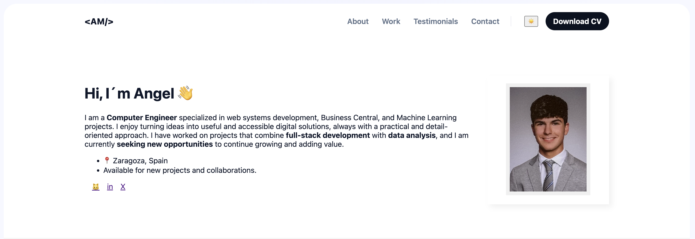
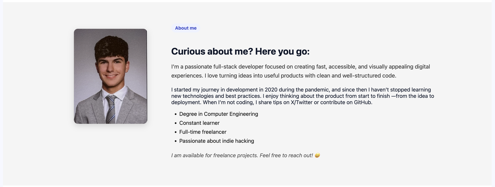
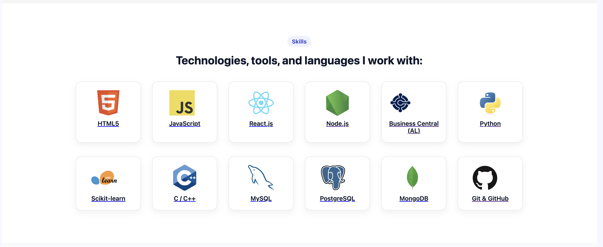
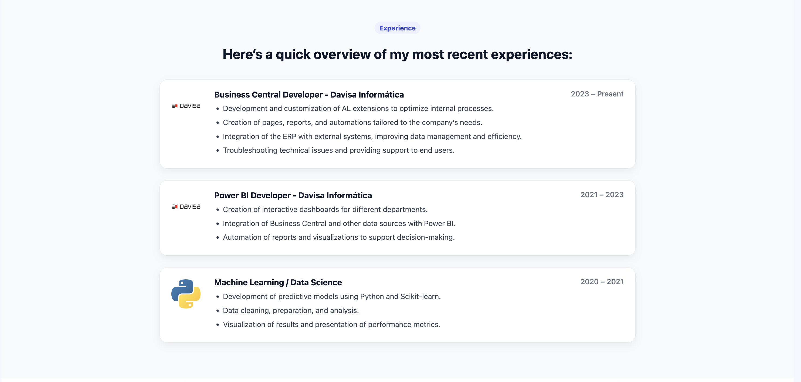
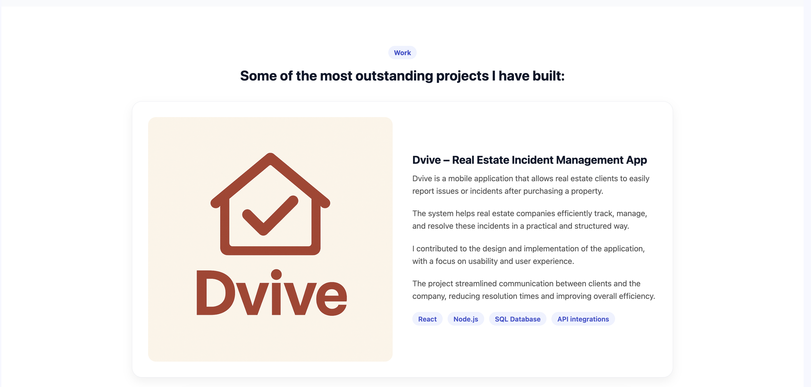
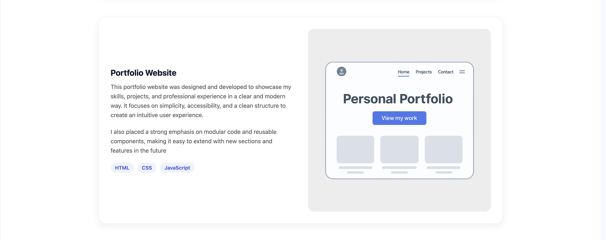
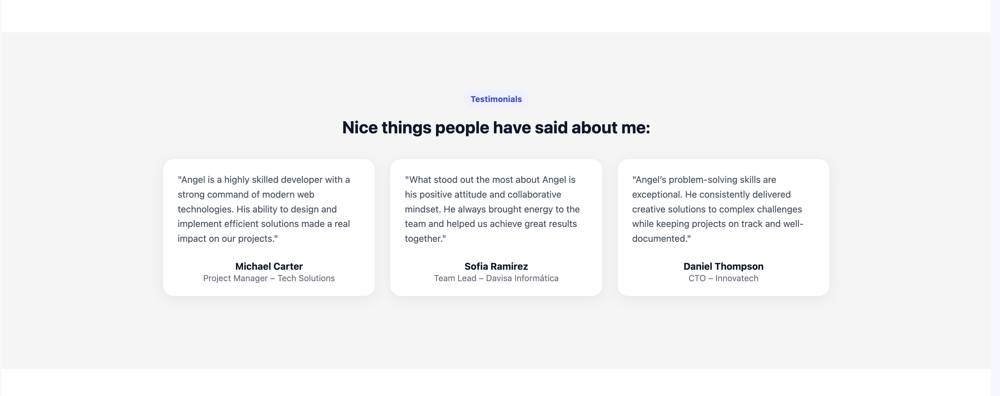
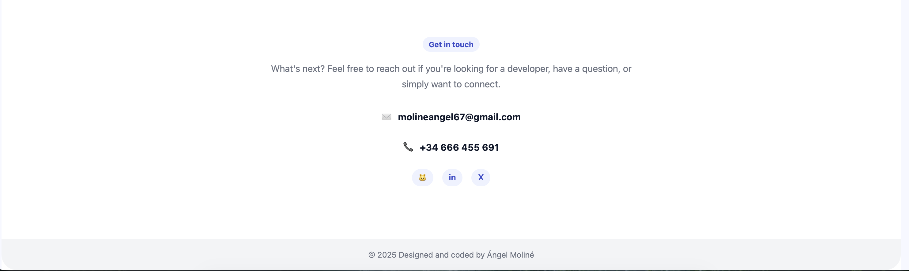

*** Portfolio Angel Moline ***

In this project, I worked on creating a website in which I had to develop a portfolio with curricular information.

For the design of the portfolio, I based it on an existing Figma file.
Figma link: https://www.figma.com/community/file/1262992249991763120

To implement it, I decided to create different segments, each one with its own CSS so that every section has a specific style.

These are the different sections with their corresponding CSS files:

1. Main navigation bar   ---> "1_styless.css"
2. Presentation block    ---> "2_hero.css"
3. About me section      ---> "3_sobre-mi.css"
4. Skills section        ---> "4_skills.css"
5. Experience section    ---> "5_experience.css"
6. Projects section      ---> "6_work.css"
7. Testimonials section  ---> "7_testimonial.css"
8. Contacts section      ---> "8_contacts.css"
9. Closing block (final) ---> "1_styless.css"

As we can see, there is also a Photos folder, which contains all the images included in the portfolio and my CV (to keep it separate from the rest of the files).

Finally, the following files are being used to publish the website through Firebase, so it would be appreciated if they are not modified:

1. ".firebaserc"
2. "firebase.json"
3. ".firebase"
4. "404.html"

Here is the URL to view the published portfolio: [Public Portfolio](https://fgdsfgsasdfsdgewtrsdfdsfsdsda.web.app)

For any questions, feel free to contact me at this email: molineangel67@gmail.com

Thank you for visiting my Portfolio.

Ángel Moliné Arruebo.

Enlace GitHub: [Public repository on GitHub](https://github.com/Angelote567/Proyecto_Portafolio)

The different screenshots of the portfolio result can be found in the folder: "Imagenes_Portfolio"

